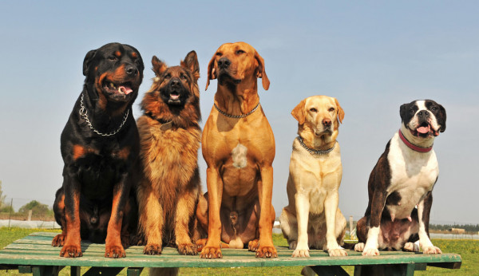

# t09 - Hub Dawgs

## Our Mission Statement:

Our team strives to create a virtual environment to connect chess players online. Through extensive collaboration and
planning, our team meticulously develops each piece of the project with a specific focus on object design and
implementation. We hope for our final product to be accessible to everyone from those that are entirely new to chess to
those with extensive knowledge and experience. Our team values clean, bug-free code that runs flawlessly. Using an
object-oriented design, we hope to seamlessly integrate chess with a handful of features that will improve player
experience.

---

## Member Information

Last Name | First Name | CSU eName | GitHub Username | CSU Email
--------- | ---------- | --------- | --------------- | ---------
Williams | Evan | tleh | tleh | evan.williams@colostate.edu
Connell | Cameron | camconn | camsn0w | camconn@colostate.edu
Bonafe | Sam |  sbonafe | sbonafe | sbonafe@colostate.edu
Nguyen| Tri | tri | tri95182 | tri@rams.colostate.edu

---

## Scrum Information

### Scrum Master:

Alternating: Sprint 4 - Cameron Connell

### Number and Length of Sprints:

6 Sprints with 2 week durations

### Sprint Calendar:

* Sprint planning date: 9/13, 9/27, 10/11, 10/25, 11/8, 11/22
* Sprint review date: 9/24, 10/8, 10/22, 11/5, 11/19, 12/3
* Sprint retrospective date: 9/24, 10/8, 10/22, 11/5, 11/19, 12/3
